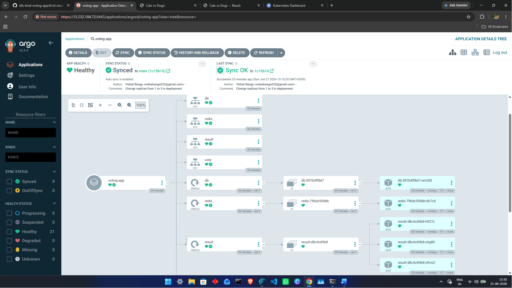
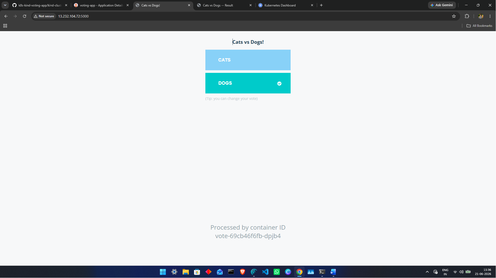
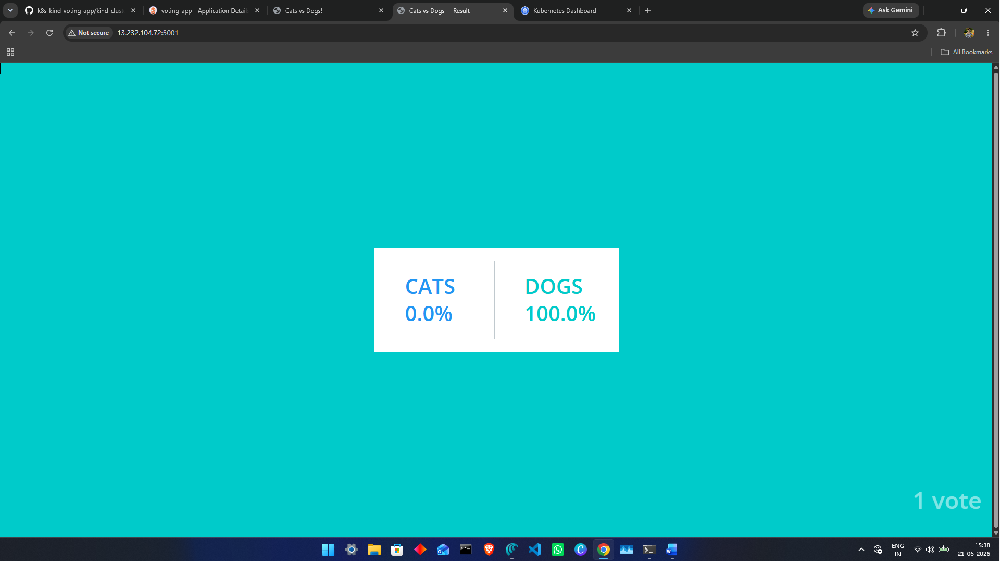
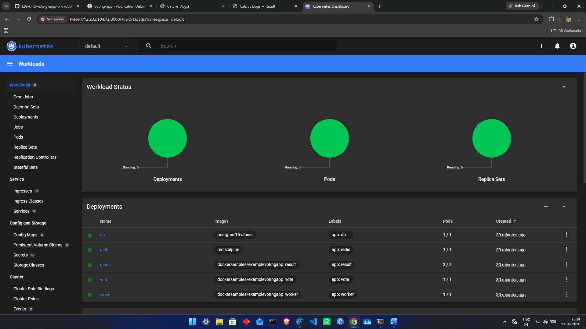
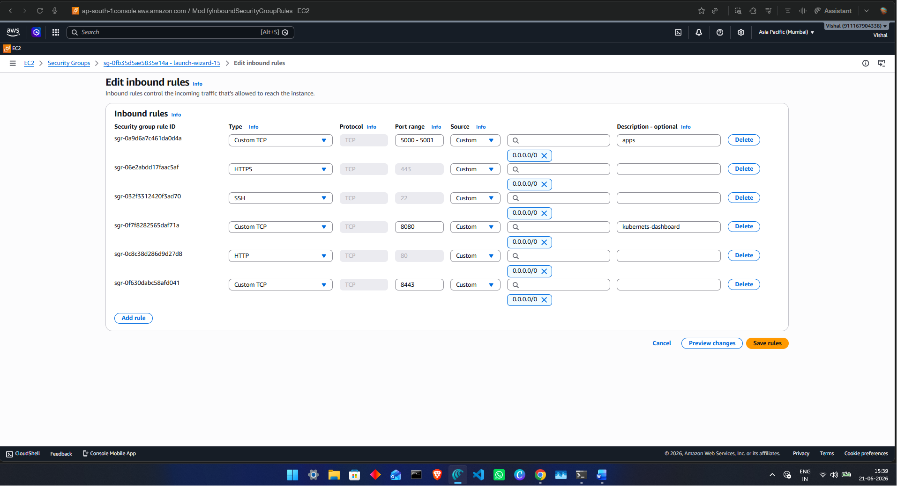
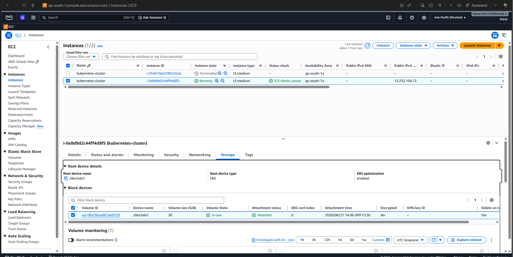

# Kubernetes GitOps Voting Application on AWS

## Project Overview

This project demonstrates a complete Cloud Native DevOps workflow using:

- AWS EC2
- Docker
- Kubernetes (KIND)
- ArgoCD
- GitHub
- Kubernetes Dashboard

The application allows users to vote between Cats and Dogs while showcasing container orchestration, GitOps deployment, and Kubernetes management.

---

## Architecture

```text
User
 │
 ▼
Vote Service (Python)
 │
 ▼
Redis
 │
 ▼
Worker
 │
 ▼
PostgreSQL
 │
 ▼
Result Service (.NET)

GitHub
 │
 ▼
ArgoCD
 │
 ▼
Kubernetes Cluster
```

---

## Tech Stack

- AWS EC2
- Docker
- Kubernetes
- ArgoCD
- GitHub
- Redis
- PostgreSQL
- Python
- .NET

---

## Kubernetes Resources

### Deployments

- Vote Deployment
- Result Deployment
- Worker Deployment
- Redis Deployment
- PostgreSQL Deployment

### Services

- vote-service
- result-service
- redis-service
- db-service

### ReplicaSets

ReplicaSets maintain the desired number of Pods automatically.

### Pods

Application containers run inside Kubernetes Pods.

---

# Project Screenshots

## ArgoCD Dashboard



---

## Voting Application



---

## Results Application



---

## Kubernetes Dashboard



---

## AWS Security Group



---

## AWS EC2 Instance



---

## Deployment Commands

### Create Cluster

```bash
kind create cluster --name voting-cluster
```

### Deploy Application

```bash
kubectl apply -f k8s-specifications/
```

### Verify

```bash
kubectl get pods
kubectl get svc
kubectl get deployments
```

### Access Vote App

```bash
kubectl port-forward svc/vote 5000:80
```

### Access Result App

```bash
kubectl port-forward svc/result 5001:80
```

### Access ArgoCD

```bash
kubectl port-forward svc/argocd-server -n argocd 8443:443
```

---

# Features

- Containerized Microservices
- Kubernetes Deployments
- Services & Networking
- ReplicaSets
- GitOps using ArgoCD
- Kubernetes Dashboard
- AWS Deployment
- Real-Time Voting Application

---

# Author

## Vishal Ranga
